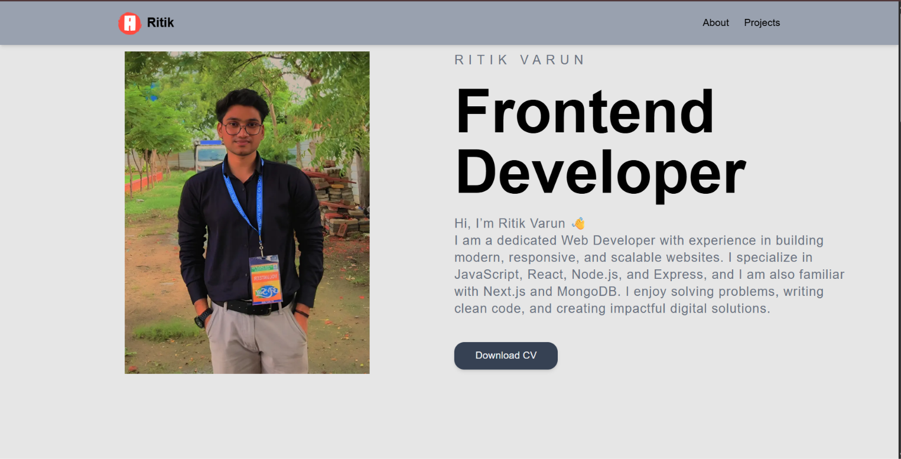

<h1 align="center">🚀 Ritik Varun — Portfolio</h1>

<p align="center">
  A modern, animated personal portfolio website built with <strong>Next.js 16</strong>, <strong>React 19</strong>, and <strong>Tailwind CSS v4</strong>.
</p>

<p align="center">
  <a href="https://www.RitikVarun.my.id" target="_blank">
    
  </a>
  
  
  
  
</p>

---

## 📸 Screenshot

<p align="center">
  
</p>

---

## 🌟 About

Personal portfolio of **Ritik Varun**, a dedicated **Frontend Developer** specializing in JavaScript, React, Node.js, and building modern, responsive, and scalable websites.

> *"I enjoy solving problems, writing clean code, and creating impactful digital solutions."*

🔗 **Live Site:** [www.RitikVarun.my.id](https://www.RitikVarun.my.id)

---

## ⚙️ Tech Stack

| Technology | Version | Purpose |
|---|---|---|
| **Next.js** | 16.2.1 | React Framework |
| **React** | 19.1.0 | UI Library |
| **Tailwind CSS** | v4 | Styling |
| **Framer Motion** | 12+ | Animations |
| **Swiper.js** | 11+ | Image Sliders |
| **Font Awesome** | 7+ | Icons |
| **Radix UI** | Latest | UI Primitives |
| **Lucide React** | Latest | Icons |

---

## ✨ Features

- 🎯 **Smooth Animations** — Powered by Framer Motion (scroll-triggered, spring animations)
- 📱 **Fully Responsive** — Works perfectly on all screen sizes
- 💼 **Projects Showcase** — With live demo & GitHub links
- 🎓 **Certificates Section** — Internship & course certificates
- 📥 **CV Download** — Direct resume download button
- 🔍 **SEO Optimized** — Sitemap, robots.txt, OpenGraph meta tags
- ⚡ **Turbopack** — Ultra-fast Next.js dev builds

---

## 📄 Pages

| Page | Route | Description |
|---|---|---|
| 🏠 Home | `/` | Hero, About preview, Projects preview, Contact |
| 👤 About | `/about` | Skills, Education, Certificates |
| 🛠️ Projects | `/projects` | All projects with details & demos |

---

## 🛠️ Projects Showcased

| Project | Tech | Links |
|---|---|---|
| **ShopX E-commerce** | React, Node.js, AI Voice Nav | [Demo](https://shopx-6u3e.onrender.com/) · [GitHub](https://github.com/ritikvarun/ShopX) |
| **Employee Management System** | React, Node.js, Express | [Demo](https://ems-bay-one.vercel.app) · [GitHub](https://github.com/ritikvarun/ems) |
| **Cara E-commerce** | HTML, CSS, JS, Swiper.js | [Demo](https://cara-e-commerce12.netlify.app/) · [GitHub](https://github.com/ritikvarun/Cara_E-commerce) |
| **LinkedIn Clone** | React | [Demo](https://linkend-in-clone.vercel.app/) · [GitHub](https://github.com/ritikvarun/linkendIn-clone) |

---

## 🧰 Skills

<p>
  
  
  
  
  
  
  
  
  
  
  
</p>

---

## 🚀 Getting Started

### Prerequisites
- Node.js >= 20.0.0
- npm or yarn

### Installation

```bash
# 1. Clone the repository
git clone https://github.com/ritikvarun/My_portfolio.git

# 2. Navigate to project directory
cd My_portfolio-main

# 3. Install dependencies
npm install

# 4. Run development server
npm run dev
```

Open [http://localhost:3000](http://localhost:3000) in your browser. 🎉

### Build for Production

```bash
npm run build
npm run start
```

---

## 📁 Project Structure

```
My_portfolio-main/
├── public/
│   ├── images/          # All images (projects, skills, certificates)
│   ├── RItik.pdf        # Resume/CV
│   ├── sitemap.xml      # SEO sitemap
│   └── robots.txt       # SEO robots file
├── src/
│   ├── app/
│   │   ├── page.jsx     # Home page
│   │   ├── layout.jsx   # Root layout & metadata
│   │   ├── about/       # About page
│   │   └── projects/    # Projects page
│   ├── components/
│   │   ├── Hero/        # Hero & all main sections
│   │   ├── Navbar/      # Navigation bar
│   │   ├── Marquee.jsx  # Skills marquee
│   │   └── Button.jsx   # Reusable button
│   └── json/
│       └── data.json    # Projects, skills & certificates data
```

---

## 📬 Contact

<p>
  <a href="mailto:ritikvarun64@gmail.com">
    
  </a>
  <a href="https://www.linkedin.com/in/ritik-varun-0b6795274/" target="_blank">
    
  </a>
  <a href="https://github.com/Ritikvarun" target="_blank">
    
  </a>
  <a href="https://www.instagram.com/arjun_rk_0021" target="_blank">
    
  </a>
</p>

---

<p align="center">
  Made with ❤️ by <strong>Ritik Varun</strong>
  <br/>
  ⭐ <em>If you liked this project, please give it a star!</em>
</p>
